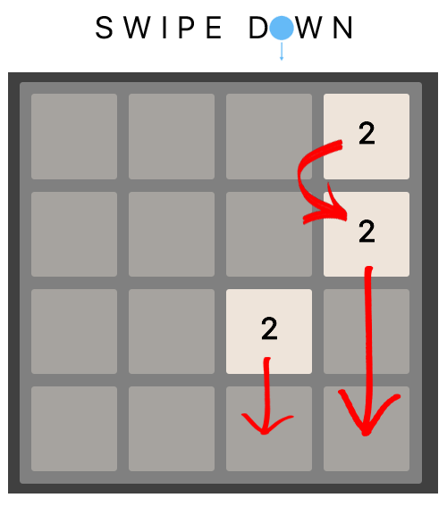
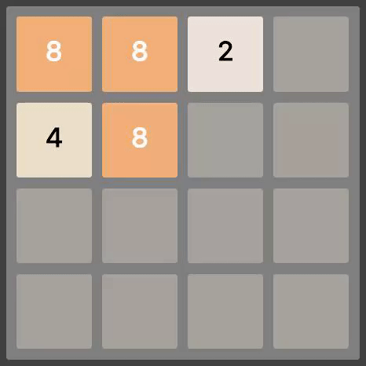
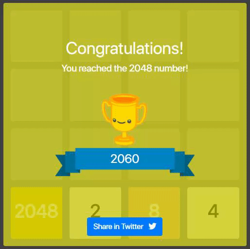

# UJA 2048
**Welcome to the Home page of UJA 2048!**

  

### Table of Contents
**[How to play](#how-to-play)** 
**[Issues](#issues)** 
**[Technologies](#technologies)** 

## How to play
A 2048 game is played in a **4x4 board**, where you will have several numbers... 
All you need to do is to **merge identical numbers**, this way you can reach higher values. 
As the game name says, you will get the **victory** once the **2048 value is reached**. :tada: :tada:

  

At the beginning you'll get only two numbers (could have a value of 2, like in the image, or 4). 
You can **merge the numbers by using the arrows keys**:

  

You can also merge the numbers by doing the **swipe gesture**, specially for mobile phones:

  

Using the arrows or the swipe gesture could make some cells collide, but that event also moves all the numbers in the specified direction:

  

Everytime you press an arrow key or use an swipe gesture, **if you move or collide any cell, a new number will appear!** This way you collect more and more numbers...

  

If you 'collect' :stuck_out_tongue_winking_eye: as many numbers as cells has the board, then you are in trouble!! :warning:  
If you still have any move where you can collide cells you're still alive, but it will be hard to get out of that situation  :expressionless:

 
The moment where you can't do any move (thus, the board is totally occuppied by numbers) you're not in trouble but totally defeated :wink:

  

The screen you must reach looks like that:

  

## Issues
We're opened to suggestions, that's why we've created a small ['Issues' page](https://uja2048.github.io/issues.html), like the Github one :octocat: where you can only create and check the issues other users submitted.  
That could be nice in case you don't want to sign in Github or you don't have an account.  

Otherwise we prefer you to submit your issue to [Github](https://github.com/UJA2048/UJA2048.github.io/issues), so we can discuss and interact with other users. That's up to you!

## Technologies
Which technologies have we used?
* [HTML5](https://www.w3schools.com/html/html5_intro.asp)
* [CSS](https://www.w3schools.com/css/default.asp)
* [Bootstrap](https://getbootstrap.com/)
* [jQuery](https://jquery.com/)
* [jQuery Mobile](http://jquerymobile.com/)
* [jQuery API](https://api.jquery.com/)
* [Firebase](https://firebase.google.com/?hl=es-419)
